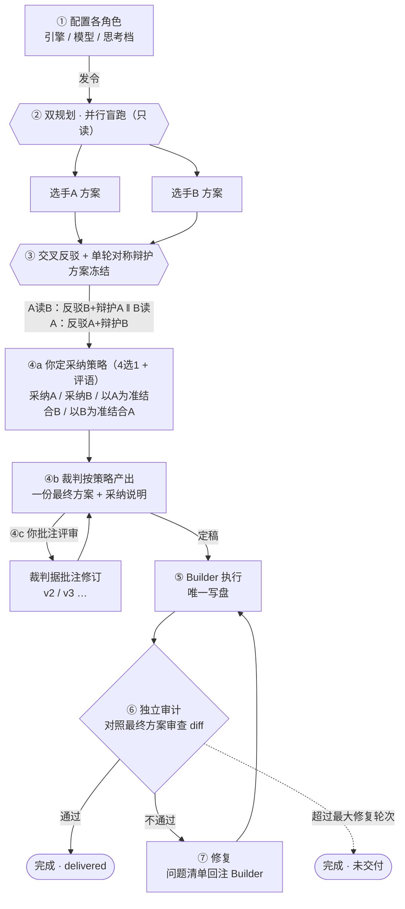
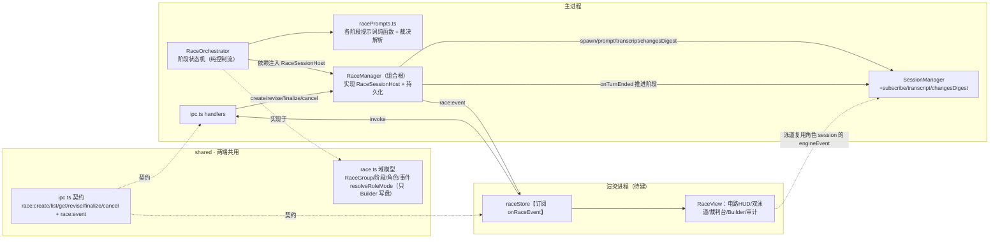

# 大模型赛马（竞争式规划工作流）设计方案

> 状态：后端骨架已实现并通过双端类型检查；前端（store/RaceView/入口）待接入。
> 适用项目：cyberslots（Electron + TypeScript，主/渲染分离，多引擎 codex/kimi/opencode）。

---

## 一、背景与目标

### 1.1 起源
需求源于一套"竞争式规划"工作流：两个大模型对同一任务各出方案，交叉反驳后由裁判收敛，再执行、审计、修复。目标是把这套**高可靠、可验证的 AI 协作决策链路**内置进本程序，作为核心差异化能力。

### 1.2 核心定位
> 赛马 ≠ 简单的"多模型并排比答案"，而是 **竞争式规划 + 交叉反驳 + 裁判融合 + 执行 + 独立审计 + 修复回环** 的有向工作流（DAG）。

### 1.3 关键结论
本程序**天生适合**做赛马，无需重造底座：

| 赛马需要什么 | 本程序已有能力 |
|---|---|
| 多模型同时跑、互不干扰 | 每会话独立引擎进程（cwd 隔离 + 崩溃隔离） |
| 跨引擎统一渲染 | 统一事件流 `UnifiedEvent → UnifiedMessage` |
| 把一份上下文喂给多个模型 | `fork` / `forkToEngine` + `contextSeed` 历史重放 |
| 审计看得到改了什么 | `ChangeTracker` 逐会话文件编辑台账 + diff |

因此赛马 = 在现有会话之上加一层 **编排器（Orchestrator）+ 跑道视图（RaceView）**。

---

## 二、核心设计思路

### 2.1 赛马是"会话组编排层"，不是特殊会话
```
RaceGroup（编排层）
├─ 选手A   = 一个真实 session（引擎/模型/思考档 可独立配）
├─ 选手B   = 一个真实 session（同上，可完全不同）
├─ 裁判     = 一个真实 session
├─ Builder = 一个真实 session（唯一有写权限）
└─ 审计     = 一个真实 session
```
每个角色都是普通 session → **"自定义各角色引擎/模型/思考深度"天然满足**，直接复用现有模型/思考档选择器；并发、隔离、崩溃恢复全部白拿。

### 2.2 一条贯穿全局的铁律：只有 Builder 写盘
| 角色 | 权限 | 落点 |
|---|---|---|
| 选手A/B、裁判、审计 | **只读**（codex/opencode → `plan` 沙箱；kimi → `default` + 只读提示前缀） | 只产出文字，不碰磁盘 |
| Builder / 修复 | 可写（`auto`） | 唯一改真实文件，走 ChangeTracker |

推论：多个只读角色即便同 cwd 并发也不会互相踩踏；只有收敛到唯一 Builder 时才动盘 → 天然无冲突。这条铁律落在 `resolveRoleMode(role, cfg)`。

### 2.3 赛道内 mode 由编排器接管，收敛后"毕业"成普通会话
- **赛马进行中**：各角色 mode 由阶段决定（选手=只读、Builder=可写），不开放手动乱切，避免破坏工作流契约。
- **赛马收敛后**：产出的 Builder 会话就是**普通会话**，Agent/Plan/Goal/Sidechat 全部照常可用。

---

## 三、完整逻辑流程（DAG）

```
① 配置各角色（引擎/模型/思考档）
        │ 发令
        ▼
② 双规划：选手A ∥ 选手B  并行盲跑（只读，互不看对方）
        ▼
③ 交叉反驳 + 单轮对称辩护（方案冻结）
     A 读 B → 反驳B + 辩护A ；  B 读 A → 反驳A + 辩护B   （同时进行）
        ▼
④ 裁判阶段（两道人工关口）
   ④a 你先定采纳策略（4 选 1，可附评语）：
        采纳A ｜ 采纳B ｜ 以A为准结合B ｜ 以B为准结合A
   ④b 裁判按策略+评语 产出【一份最终方案】
        │
        ├─◄── ④c 你批注评审 ──► 裁判据批注修订（v2、v3…，类 Plan 模式迭代）
        │ 定稿
        ▼
⑤ Builder 执行最终方案（唯一写盘）
        ▼
⑥ 独立审计：对照最终方案审查 Builder 的 diff
        ├─ 通过 → 完成（delivered）
        └─ 不通过 →⑦ 修复：问题清单回注 Builder → 回⑥（最大轮次上限，防死循环）
```

### 流程图（mermaid）



### 各阶段定义

| 阶段 | 谁在跑 | 喂什么进去 | 产出 |
|---|---|---|---|
| ① 配置 | — | — | RaceRoleConfigs |
| ② 双规划 | A、B 并行 | 同一任务 prompt | 两份方案 |
| ③ 反驳辩护 | A、B 并行 | 对方方案（`contextSeed`/prompt 注入） | 各自"反驳+辩护" |
| ④a 采纳决策 | 你 | 双方方案 + 反驳辩护（预览） | 采纳策略（4选1）+ 评语 |
| ④b 裁判出方案 | 裁判 | 策略 + 评语 + 双方方案/反驳辩护 | 一份最终方案 + 采纳说明 |
| ④c 批注修订 | 裁判 | 用户批注 + 当前方案 | 修订版（版本号 +1） |
| ⑤ Builder | Builder（可写） | 最终方案 | 代码改动（ChangeTracker） |
| ⑥ 审计 | 审计 | 最终方案 + Builder diff 摘要 | 裁决 PASS/FAIL + 问题清单 |
| ⑦ 修复 | Builder | 审计问题清单 | 修复改动 → 回⑥ |

---

## 四、关键设计决策（含取舍理由）

### 4.1 Plan A / Plan B —— 并行盲跑
两方**同时、独立**出方案，互不看对方。理由：公平竞速才配得上"赛马"；若顺序生成让 B 看到 A，会失去独立性。

### 4.2 交叉反驳 —— 单轮对称辩护，方案冻结
互驳结果**要发回对方一轮**，让对方辩护/澄清。理由：
- 不发回的硬失败模式：A 误读 B 并提出**不成立**的批评，B 无从解释，裁判（也是 LLM）会**照单全收**冤枉 B。
- 发回一轮辩护 → 过滤掉站不住脚的批评，只留经得起反驳的真问题给裁判，显著提升裁判质量。

两条铁律：
1. **只发一轮**（二轮后 LLM 几乎零增益，纯烧钱）；
2. **对称同时**（A 辩 B、B 辩 A 同时交裁判，避免"谁最后发言谁占便宜"的 last-word bias）；
3. **方案冻结**（只辩护、不改方案）——保持公平对决，测的是方案稳健性，也避免"移动靶"导致对比基准不稳。

### 4.3 裁判 —— 你定方向，裁判执笔（两道人工关口）
1. **采纳决策前置给用户**：读完双方方案与反驳/辩护后，由用户先选采纳策略（采纳A / 采纳B / 以A为准结合B / 以B为准结合A），并可附评语作指导意见；
2. 裁判**严格按用户策略+评语**产出一份最终方案（附采纳说明），而不是自作主张替用户裁决。

理由：方向性决策（用谁的骨架）是人最该拍板的；裁判擅长的是按方向执笔融合。两道关口（先定向、后终审）确保方向不跑偏。

### 4.4 裁判方案 —— 人工批注 + 迭代修订（类 Plan 模式）
最终方案交由**用户批注审核**；用户批注后裁判据此**修订**（版本号 v1→v2…），可循环，直到用户**定稿**。定稿后才交给 Builder。

### 4.5 只读隔离复用 Sidechat 现成机制
codex/opencode 读只读角色用 `plan` 模式（read-only 沙箱）；kimi 的 plan 模式会触发写计划文件，故 kimi 只读用 `default` + 只读提示前缀（`READONLY_GUARD`）。

### 4.6 修复回环有界
审计不过 → 问题回注 Builder → 再审计，但设**最大轮次上限（默认 3）**，防死循环。

### 4.7 2 选手对决
锁定双泳道对决（完美贴合现有 SideChatPanel 分屏范式）；Builder 收敛成单线；未来"多 Builder 赛马"是另一层嵌套，暂不做。

---

## 五、与现有功能的互斥/共存/边界

### 5.1 功能矩阵

| 现有功能 | 配置中 | 赛道进行中 | 裁判/审计 | Builder 执行 | 收敛后(普通会话) |
|---|---|---|---|---|---|
| Agent/Plan 手切 | — | 🔒锁定 | 🔒锁定 | ✅ | ✅ |
| 权限档 auto/yolo | 每角色可预设 | 🔒选手强制只读 | 🔒只读 | ✅可配 | ✅ |
| Goal（codex） | ✖ | ✖ | ✖ | △(codex可) | ✅ |
| Sidechat | ✖ | ✖ | ✖ | ✅ | ✅ |
| 等待队列 Queue | — | △ 队到下一轮 | — | ✅ | ✅ |
| Compact 压缩 | — | ✖(方案有界) | ✖ | ✅回合边界 | ✅ |
| 切引擎 forkToEngine | =改角色引擎 | ✖ | ✖ | ✅ | ✅ |

**串/并行**：并行 = 选手A∥B（规划、反驳同时）；串行 = 规划→反驳→融合→Builder→审计→(修复↺审计) 硬 DAG。一个 App 内可并存多个 RaceGroup（后台跑，侧栏标记）。

### 5.2 边界场景与处理

| 场景 | 处理 |
|---|---|
| 某选手中途报错/崩溃 | 进程隔离，另一方照跑；可"以现存选手裁决"或重跑该赛道 |
| 一方远快于另一方 | Photo-finish 等两方；超阈值提示"对手超时，是否以现有结果裁决" |
| App 重启于赛道中 | 引擎进程已死 → 该 race 标记 `done`（避免 UI 永等死会话）；方案产物保留可回看 |
| 中途转赛马 | fork 父会话上下文作为两选手共同起跑线；原对话保留为父 |
| 审计反复不过 | 最大修复轮次上限触发 → 完成但 `delivered=false` |
| 嵌套赛马 | v1 禁止递归，Builder 只能开 Sidechat/普通功能 |

---

## 六、交互设计（优雅 · 科技感）

### 6.1 统一隐喻：能量赛道电路
把 DAG 画成一块正在通电的赛道电路——节点是关卡、连线是电流，能量从起跑流到修复回环。

### 6.2 常驻组件：赛程电路 HUD（顶部）
- 未到达：暗灰空心圆；进行中：accent 实心 + 呼吸光环，节点间能量粒子流动；已完成：填满 + ✓。
- 修复回环：审计→Builder 折返支线，激活时能量逆向回流。
- 每节点下方极小等宽字标注角色引擎·用时（遥测感）。

### 6.3 双泳道竞速（复用 SideChatPanel 分屏规范）
- 左右对称两栏，中间分道线；每栏顶部霓虹进度线随 token 拉长。
- 栏内是该角色 session 的实时流（thinking 折叠 + 正文，复用 MessageItem）。
- 冲线：亮 🏁 + 用时定格（`apiDurationMs`）。

### 6.4 裁判台（采纳决策 → 出方案 → 批注修订）
- 参考区（可折叠）：双方原始方案 + 反驳 + 辩护。
- **采纳策略条（第一道关口）**：四枚胶囊「采纳A / 采纳B / 以A为准结合B / 以B为准结合A」+ 评语输入框 → 提交后裁判开始出方案。
- 最终方案卡（版本号 v?）+ 采纳说明。
- 批注框 + 两动作：`按批注让裁判修订`（版本 +1）/`定稿，交给 Builder`。

### 6.5 Builder / 审计 / 修复
- Builder：文件改动逐条点亮登记；审计：绿色"通过"印章 / 红色"未通过"+问题清单；修复：电路回环能量逆流。

### 6.6 配色与克制原则
- **中性高级风**（Linear/Vercel 那类）：近黑中性灰底 + 克制靛蓝(选手A)/低饱和暖砂(选手B)，**无霓虹发光、无彩色高亮边框**。
- 思考深度滑块用简洁旋钮 + 轨道内低调流光；档位值作为滑块标题、滑块置于配置卡最底部、随档位不同填充。
- 所有动效走 CSS transform/opacity，提供"降低动效"开关并尊重 `prefers-reduced-motion`。

---

## 七、技术架构

### 7.1 模块划分（高内聚低耦合）

```
src/shared/race.ts                 —— 域模型（两端共用，零依赖）
src/main/race/racePrompts.ts       —— 各阶段提示词纯函数 + 审计裁决解析
src/main/race/RaceOrchestrator.ts  —— 阶段状态机（依赖注入 RaceSessionHost）
src/main/race/RaceManager.ts       —— 组合根：实现 RaceSessionHost，桥接会话层/IPC/持久化
src/main/engine/SessionManager.ts  —— 附加 subscribe/transcript/changesDigest（纯附加）
（前端待建）
src/renderer/src/store/raceStore.ts        —— 前端状态切片
src/renderer/src/components/race/RaceView… —— 视图组件群
```

### 架构图（mermaid）



### 7.2 解耦要点
- **RaceOrchestrator 是纯控制流**，通过注入的 `RaceSessionHost` 接口与引擎交互 → 可单测、可替换。
- **唯一耦合点是 RaceManager**（组合根），把编排器绑到 SessionManager + Electron IPC + 磁盘持久化。
- **提示词与控制流分离**（racePrompts 纯文本 vs Orchestrator 流程）。
- 铁律"只有 Builder 写盘"集中在 `resolveRoleMode`。

### 7.3 数据模型（shared/race.ts）
- `RaceRole` = racerA/racerB/judge/builder/auditor；`RaceRoleConfig` = {engine, modelId, effort?, permissionMode?}。
- `RaceStage` = config/planning/rebuttal/judging/building/auditing/repairing/done。
- `RaceGroup` = {id, prompt, cwd, roles, stage, sessions(每角色 session id), **adopt(采纳策略+评语)**, finalPlan, finalPlanVersion, annotations[], audit, repairRound, maxRepairRounds, parentSessionId, 时间戳}。
- `RaceAdoptStrategy` = adoptA/adoptB/aOverB/bOverA（裁判阶段用户 4 选 1）。
- `RaceEvent`（main→renderer）= race.stage / race.role / race.finalPlan / race.audit / race.error / race.done。

### 7.4 会话层附加（SessionManager，纯附加不破坏现有）
- `subscribe(sessionId, cb)`：内部订阅引擎事件（编排器观察 turn.ended），与 renderer 转发并行。
- `transcript(sessionId)`：主进程侧独立累积"当前回合助手正文"（不依赖 renderer 持久化时序）。
- `changesDigest(sessionId)`：Builder 改动文本摘要，供审计对照。
- 数据安全红线：以上均为附加，未改动任何现有历史消息路径。

### 7.5 IPC 契约
- renderer→main：`race:create / race:list / race:get / race:adopt / race:revise / race:finalize / race:cancel`。
- main→renderer：`race:event`（阶段/角色/融合方案/审计等编排事件）。
- 沿用现有 `shared/ipc.ts`(通道+API) → `preload`(透传) → `main/ipc.ts`(handler) 模式。

### 7.6 事件流与状态机推进
- 编排器对角色 session 调 `prompt` 后，通过 `onTurnEnded` 等待回合结束再推进下一阶段。
- 并行阶段（规划/反驳）用 `Promise.all` 等两方都冲线。
- 角色间产物交接通过 `transcript`；产物（planA/B、rebuttalA/B）存于编排器的瞬态 artifacts（不持久化）。
- 每次状态变更 `persist(groups)` 落盘 races.json。

### 7.7 恢复与容错
- 重启后角色 session 进程已死 → 加载时把未完成的 race 标记 `done`，避免 UI 永等；方案数据保留。
- 单角色失败经 `safe()` 包裹为 `race.error` 事件，不使主进程崩溃。

---

## 八、角色自定义
一份可存的 RaceProfile：5 张角色卡（选手A/B/裁判/Builder/审计），每卡独立配 引擎 + 模型 + 思考档（复用现有选择器）；预设"三巨头对决/快慢配/同模不同档"。每阶段可跳过（简单任务跳过反驳直接裁判）。

---

## 九、落地状态与后续

### 已完成（node + web typecheck 均通过）
- shared/race.ts、main/race/{racePrompts,RaceOrchestrator,RaceManager}.ts
- SessionManager 附加 subscribe/transcript/changesDigest
- IPC 通道 + preload + main/ipc + main/index 接线

### 待办
- `raceStore.ts`：订阅 onRaceEvent，维护赛马状态（泳道复用现有 session ui）。
- `RaceView` 组件群：电路 HUD / 双泳道 / 裁判台 / Builder / 审计（接真实事件流）。
- 入口：Composer ⚡赛马模式（与 Goal/Plan 互斥）+ App 挂载赛马视图。
- 角色 session 侧栏隐藏/分组（可给 SessionMeta 加 raceId 标记）。
- 构建验证（electron-vite build）。

### 未来扩展
- AI 裁判评分卡（多维评分/雷达，作为融合参考）。
- Goal 赛马变体、Cron 定时发起赛马。
- 审计裁决更结构化（超越 VERDICT: PASS/FAIL 文本解析）。
